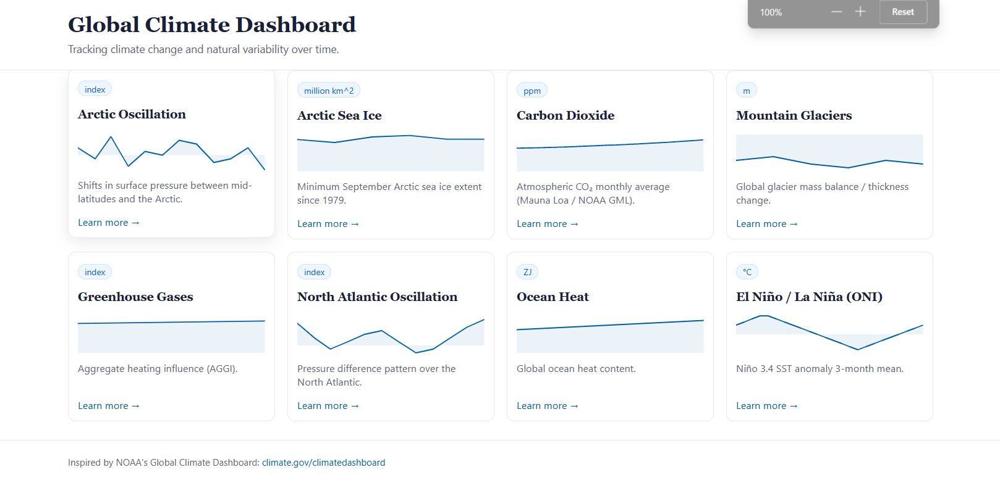
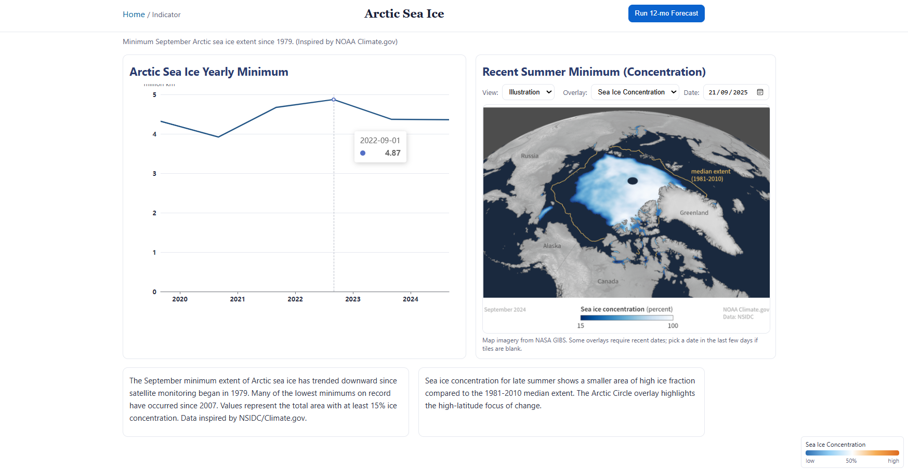
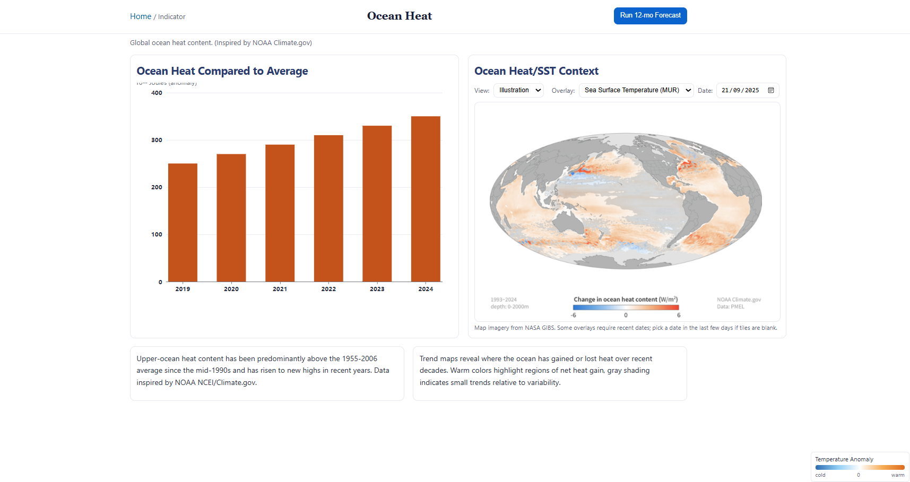

# Real-Time Global Climate Analysis Dashboard

Inspired by NOAA's Global Climate Dashboard (`https://www.climate.gov/climatedashboard`).

## Quickstart (Local)

1. Create a virtual environment
   - Windows PowerShell:
     - `python -m venv .venv`
     - `.\.venv\Scripts\python -m pip install --upgrade pip`
2. Install dependencies
   - `.\.venv\Scripts\python -m pip install -r requirements.txt`
3. Run the app (development)
   - `.\.venv\Scripts\python -m uvicorn app.main:app --reload`
4. Open the dashboard
   - `http://127.0.0.1:8000/`

## Configuration
- `REFRESH_SECONDS` (env): interval for background refresh + broadcast (default `3600`)
- `.env` (optional): you can export environment variables before starting the server
  - PowerShell example: `$env:REFRESH_SECONDS=900; .\.venv\Scripts\python -m uvicorn app.main:app --reload`

## Docker

Build and run:
```bash
docker build -t climate-dashboard .
docker run --rm -p 8000:8000 -e REFRESH_SECONDS=900 climate-dashboard
```
Then open `http://127.0.0.1:8000/`.

## Structure
- `app/`: FastAPI backend, WebSocket updates, data adapters, PyTorch forecaster
- `frontend/`: Static frontend (ECharts) served by FastAPI
- `frontend/static/maps/`: Per-indicator illustration images (`ao.jpg`, `sea_ice.jpg`, …). Optional high‑DPI: `ao@2x.jpg`
- `docs/screenshots/`: Screenshots used in this README (create this folder)
- `data/`: Sample fallback CSVs used if remote fetches fail
- `.env` (optional): API keys or configuration overrides

## Screenshots
Add three images into `docs/screenshots/` (for example, `home.png`, `indicator.png`, `map.png`) and commit them. Reference them in Markdown like this:

```markdown



```

## Notes
- This project aggregates publicly available climate indicators and provides live updates plus short-term forecasts using PyTorch.
- Data sources inspired by NOAA/NASA indicators presented at [climate.gov/climatedashboard](https://www.climate.gov/climatedashboard).
